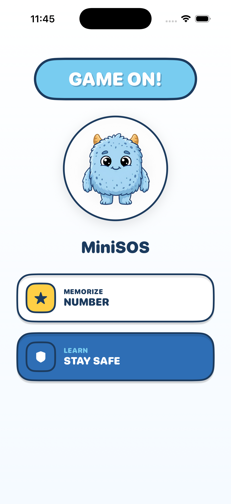
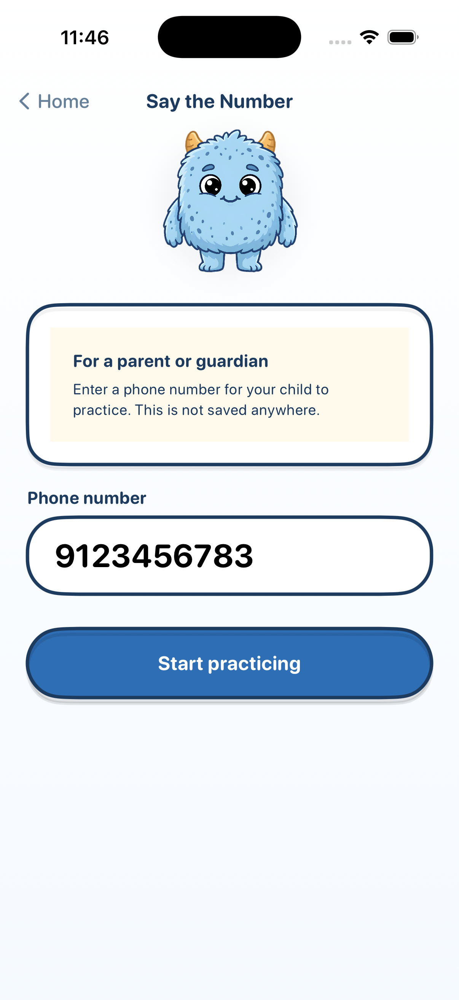
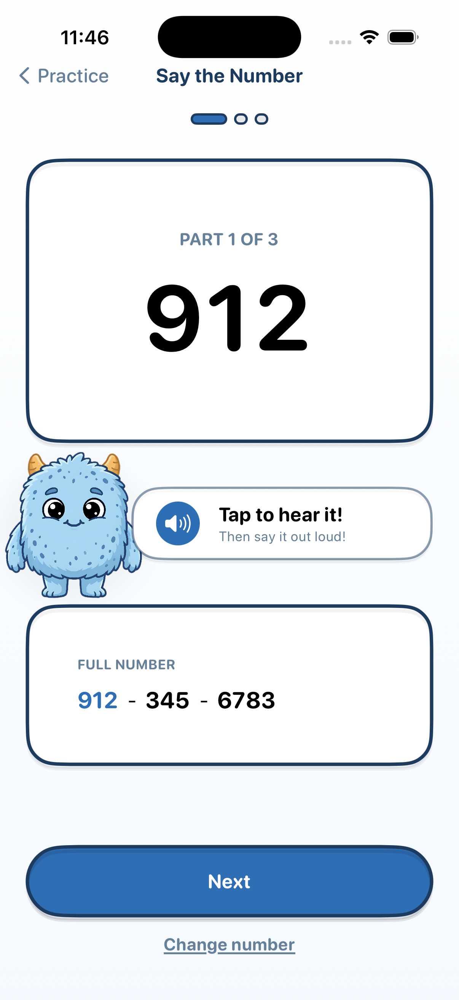
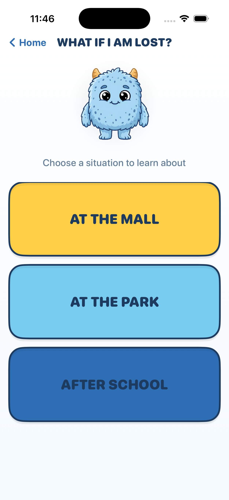
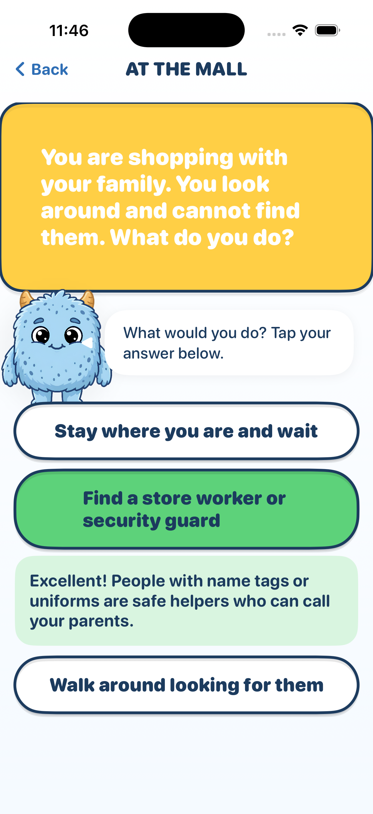

# MiniSOS 🎮✨

**MiniSOS** is a fun way for kids to learn safety skills! Built for the Swift Student Challenge, it helps children stay safe and confident.

## What's Inside?
- **Stay Safe Stories**: Interactive scenarios like "What if I am lost?".
- **Number Fun**: Easy way to memorize family phone numbers.
- **Voice Help**: The app talks to you while you learn!

## Screenshots

  
  
  
  
  

## 🛠️ Built With
- **SwiftUI** (100% Offline & Private)
